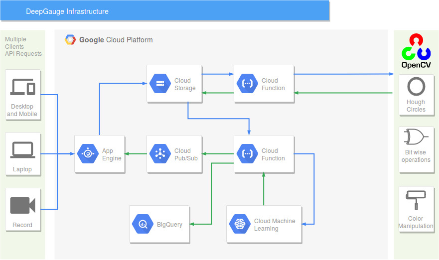

# DeepGauge

In this project an ensembling machine learning (ML) model is trained and used to predict pressure levels from a manual gauge' images. The steps taken to train the model and implement predictions are explained in the gaugeReader jupyter notebook. To use this notebook, first install Python 3.6 and jupyter, and then run the following command in a terminal to clone the repository and open the notebook. 

1- run 'git clone https://github.com/oci-labs/DeepGauge-ML-Demo.git'

2- go to the repository folder in the terminal

3- run 'jupyter notebook'

4- click on gaugeReader.ipynb to open the notebook

